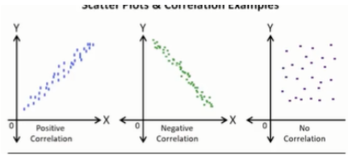

# Principios de Visualización de Datos

- GENERALIDADES
    
    ¿Qué es la visualización de datos?: se define en 2 términos:
    
    - El input: que es donde se encuentran los datos ya sea que estén organizados o no. Información (data)
    - Output: es la presentación de los datos de una manera visual para ayudar a retener la información. Revelaciones (Insights) e historias. Nos ayuda a reconocer patrones.
    
    La visualización de datos sirve para reconocer patrones o encontrar más información para investigar.
    
    Los mapas, los ábacos, son ejemplos de visualización de datos, por lo que no es un tema nuevo.
    
    Utilizando la visualización de datos podemos organizar y mejorar el aprendizaje de datos en la era de la información.
    
    Importancia de la visualización de datos: la carga cognitiva
    
    La carga cognitiva es el esfuerzo que tenemos que hacer para retener la información. A mayor carga cognitiva mayor esfuerzo. La visualización efectiva y una carga cognitiva muy baja nos va a ayudar a entender nuestra información porque vamos a poder entregar el mensaje adecuadamente de una forma eficiente a nuestra audiencia y van a poder retenerlo de una manera muy sencilla.
    
    “Visualization gives you answers to questions you didn’t know you had” Ben Shneiderman.
    
    La comunicación es importante ya que, al momento de hacer visualización de datos asumimos un rol importante porque existe una audiencia que va a recibir de forma directa o indirecta nuestro mensaje. Siempre debemos evitar el sesgo y que los datos hablen con la pura verdad.
    
    Herramientas más comunes:
    
    - Excel: al momento de graficar
    - Tableau: Es una de las herramientas para visualización de datos más famosas gracias a la comunidad. Es muy famoso también por ayudarnos a utilizar los data visualization para la creación de tableros y luego a un formato conocido como el storytelling.
    - Power BI: generalmente usada en el ámbito corporativo. En lo único que tiene similitud con el Excel es en la visualización de datos.
    - Google Analytics y Google Data Studio: generalmente son utilizados para el ámbito de mercadotecnia y nos sirve para ver los datos y la información y crear tablas o visualizaciones de datos para la información de nuestras campañas, cosas por click y nuestros anuncios en publicidad en google Adds
    
    2 dimensiones: es más de un sentido en el que nos va a mostrar información
    
    [https://informationisbeautiful.net/](https://informationisbeautiful.net/)
    
    Buenas prácticas: para poder lograr un buen mensaje de manera efectiva y sin que se incluyan nuestras referencias personales.
    
    - Define una audiencia y motivo: se debe saber a qué tipo de público está enfocado tu mensaje y qué es el mensaje que le estás mostrando.
    - Utiliza la percepción visual: son los elementos que nos van a ayudar a disminuir la carga cognitiva al momento de hacer el delivery de lo que queremos mostrar. Mientras más hagas esfuerzo para que la disminución de la carga cognitiva se realice es mucho más sencillo que la audiencia te entienda y retenga la información por mucho tiempo.
    - Estandariza: tenemos que evitar cualquier tendencia engañosa por lo que mantenemos unos estándares durante toda nuestra visualización. Las preferencias personales dentro del data visualization no están permitidas.
        - Usa mismas medidas
        - No cortes los axis
        - Alinea siempre
    - Simplifica pero no recortes: tenemos que hacer nuestras gráficas lo más sencillas posibles para disminuir la carga cognitiva.
    - Disminuye el sesgo (bias): NO al cherry-picking: siempre dejar a un lado las preferencias personales y dejar que los datos hablen por ellos mismos de la manera más objetiva. El Cherry-picking se refiere a retomar o tomar simplemente los datos que nos van a ayudar a demostrar nuestro punto, pero esto es un error y siempre debe evitarse ya que es una medida tendenciosa y puede forzar los gráficos y los resultados para la audiencia requerida.
    - Recuerda: principios Gestalt: entre estos principios podemos encontrar:
        - La ley de la proximidad, que menciona que de manera inconsciente entendemos que los datos que se encuentran más próximos pertenecen a un mismo grupo.
        - La ley de la similitud en donde dice que las cosas con la misma forma o color también pertenecen a un mismo grupo.
        - La ley de la continuidad menciona que los datos orientados en un mismo lugar siempre tienden a formar patrones o algún tipo de tendencia.
    
    Principios de la Gestalt: proximidad, similitud, cierre, continuidad, y Prägnanz (figura-tierra). La psicología de la Gestáltica es un intento de entender las leyes que subyacen a la capacidad de adquirir y mantener percepciones significativas en un mundo aparentemente caótico.
    
    Ética en la visualización de datos.
    
    Dependiendo de cómo mostremos el mensaje es la manera en la que la audiencia va a entender y retener la información. Queremos evitar causar malas interpretaciones y evitar mandar un mensaje que no era el adecuado o no uno objetivo.
    
    - Credibilidad y mensaje: tenemos que saber que una vez perdida esta confianza en la audiencia es sumamente difícil volver a obtenerla. Los datos deben mostrarse sin preferencias personales y deben servir solamente para mostrar la verdad.
- DATA VISUALIZATIONS
    
    Los data visualizations (Data Vis) son importantes al momento de hacer reportes porque nos van a facilitar enviar el mensaje, sobre todo a las altas gerencias.
    
    La visualización de datos no es un tema exclusivamente digital.
    
    Gráfica de barras: es una representación utilizando barras que nos ayudan a hacer una comparación relativamente rápida a simple vista y que nos puede ayudar a entregar el mensaje de una manera efectiva y contundente a la audiencia. Es un injerto de datos por categorías en el cual la altura de la barra nos indica la frecuencia en que los datos se van repitiendo y nos ayuda a entender el total de la información que queremos dar.
    
    - Existen verticales, horizontales y apiladas.
    - Debemos usar un color distinto para cada una de las categorías para poder diferenciarlo bien.
    - Debemos representarlos de mayor a menor para entender y visualizar de una manera más efectiva y ordenada nuestros datos.
    - siempre empezar desde cero.
    
    In conclusion, while the column chart is helpful to facilitate all comparison-based analysis, it is better to use the bar chart when your data labels are long, or you have too many data sets to display.
    
    Gráfica de pie o pastel: es un círculo en donde la categoría de nuestros datos van a tener una representación horaria dentro de este.
    
    - No es recomendable para más de 5 categorías.
    - Se puede simplificar y convertir en una gráfica de dona solo por estética y para simplicidad.
    - Anotaciones para que se muestre cual es el valor preciso de los valores que tenemos porque se puede ver el area pero es importante saber cuanto vale.
    - Nunca utilizar gráficas en 3D. Son innecesarias y afectan la percepción visual de lo que queremos dar a conocer.
    
    [https://www.fusioncharts.com/resources/charting-best-practices/selecting-the-right-chart-type-for-your-data](https://www.fusioncharts.com/resources/charting-best-practices/selecting-the-right-chart-type-for-your-data)
    
    Gráfica de dispersión o Scatter plot: Ampliamente utilizadas en el Business intelligence y en la ciencia de datos. Es un posicionamiento en un plano de puntos segun la correlación entre 2 variables (en el eje x y y).
    
    - Los colores son muy importantes.
    - Entender lo que quiere decir la dispersión de los eventos en el plano.
    
    
    
    - Tener cuidado al momento de poner anotaciones, que puede evitar la visualización de los puntos
    
    The point of using one of these is to determine if there are patterns or correlations between two variables.
    
    Use a scatter plot when your independent variable has multiple values for your dependent variable.
    
    The patterns or correlations found within a scatter plot will have a few different features:
    
    - Linear or Nonlinear: A linear correlation forms a straight line in its data points while a nonlinear correlation might have a curve or other form within the data points.
    - Strong or Weak: A strong correlation will have data points close together while a weak correlation will have data points that are further apart.
    - Positive or Negative: A positive correlation will point up (i.e., the x- and y-values are both increasing) while a negative correlation will point down (i.e., the x-values are increasing while the corresponding y-values are decreasing).
    
    Gráfica de burbujas o bubble chart: es una variación del scatter plot en donde el tamaño de la burbuja nos va a mostrar una dimensión adicional.
    
    - no necesariamente debemos hacer en una correlación como el scatter plot. Podemos mantener el gráfico como único sin tener que definir un eje x y y
    - Tener cuidado en las anotaciones, sobre todo en las burbujas más pequeñas porque pueden pasar desapercibidas.
    - El uso de colores.
    - No utilizar gráficos 3D
    
    
    
    Mapas: representación gráfica de datos ubicados geográficamente. En la mayoría de los casos es necesario el uso de los datos geolocalizados porque necesitamos entender en qué parte están ubicados cada una de nuestras representaciones.
    
    - Es importante un uso limpio de anotaciones. Simplificar nuestras anotaciones. No caer en la sobreposición de anotaciones
    - Los mapas no tienen que ser representados de una manera realista.
    - lo importante es entender que nos referimos a una gráfica que representa una proporción de un área sobre una superficie plana.
    
    Entre los distintos tipos de representación en mapas que existe, podemos encontrar los más conocidos y utilizados:
    
    - Mapas de isolíneas: Utilizan líneas para poder unir áreas que determinen cierta similitud relacionada con alguna variable. Estos espacios suelen colorearse para mostrar distinción entre ellos. Este tipo de mapas son muy utilizados en el ámbito meteorológico, en el caso de la imagen podemos observar un mapa isobárico para medir la presión atmosférica.
    - Mapas coropléticos: representan con color los lugares donde ocurrieron ciertos sucesos (variable).
    - Mapas de diagramas: pueden considerarse como mapas combinados, ya que por lo general utilizan el color para hacer una distinción de variable y alguna otra visualización sobre cada segmento para mostrar una variable adicional. Generalmente estos mapas son utilizados en estadística geográfica, reportes económicos, de salud, etc.
    - Mapas anamórfico: utilizan distintos tipos de figuras geométricas para identificar sucesos en determinadas ubicaciones geográficas.
    
    Mapas de calor: nos permite superponer sobre otra visualización una paleta de colores que nos va a ayudar a entender la frecuencia de los objetos o resultados que tengamos en nuestra base de datos. Nos ayuda a saber donde son los lugares en donde más se repiten los sucesos.
    
    - Estar pendiente de la calibración de la paleta de colores.
    
    Tablas: se utiliza cuando queremos entregar un mensaje acompañado de otro data visualization.
    
    - A menos que la audiencia sean específicamente expertos en la materia y lo pidan, no utilizar datos tan extensos.
    
- STORYTELLING EN LA VISUALIZACIÓN DE DATOS
    
    El storytelling es la técnica de comunicación en la cual hilamos historias para poder comunicar un mensaje de una forma estructurada, clara y entretenida para la audiencia. De manera que pueda retenerse de una forma prolongada gracias a la captación de la atención y uso de lenguajes sencillos para explicar conceptos más complejos.
    
    Algunas de las buenas prácticas es utilizar analogías (las hamburguesas) para explicar con conceptos sencillos los términos más complejos así como definir “story points” y visualizaciones adecuadas a nuestro mensaje.
    
- DATA VIZ FOR BUSINESS
    
    Las viz juegan un papel importante en los negocios sobre todo al momento de realizar reportes. Tenemos que darles a entender en el menor tiempo posible la mayor cantidad de información a dirección y gerencia para facilitar la toma de decisiones. El tiempo es oro.
    
    - Comunicación
    - Eficiencia y mejora.
    
    ¿Cómo agregamos valor con datos?: va de la mano con el big data y Business Intelligence. En el momento que pasan de ser números y letras a ser toma de decisiones estamos agregando valor para nuestro proyecto. Lo importante para generar valor es ofrecer información relevante con las que se puedan hacer cosas, alcanzar objetivos o tareas.
    
    - Explora: al momento de explorar en nuestra base de datos podemos encontrar cosas que no sabíamos que estaban ahí e incluso llegar un poco más a la verdad
    - Descubre:
    - Pregunta: al momento de hacernos preguntas encontramos cosas relevantes y podemos empezar a crear nuestras historias.
    - Trabaja en equipo.
    - Toma decisiones
- BUSINESS INTELLIGENCE
    
    Se refiere a la inteligencia (información) del negocio. Recae mucho sobre las Data visualization.
    
    Las personas encargadas del business intelligence son personas que conocen el negocio a profundidad (entienden el “Know how” del negocio), esto es importante porque nos pueden identificar las actividades principales, los ingresos de las empresas, costos, tendencias, etc y saben cómo se pueden utilizar estas medidas junto con las visualización de datos para mejorar la toma de decisiones.
    
    BI y Data Science están relacionados porque la ciencia de datos es un compendio de diferentes términos. El BI puede interpretar todos los experimentos o la información generada desde el data science para que pueda traducirlo a un lenguaje un poco más simplificado y utilizando data visualizations para entregar un mensaje de alta calidad para la toma de decisiones hacia gerencia.
    
    Recolección de datos: es nuestra primera etapa dentro de nuestro proceso.
    
    - Diversidad: la información puede ser diversa. Prácticamente todo se puede analizar y hay diferentes técnicas y maneras para cada tipo de información.
        - Bases públicas o privadas
        - La información puede venir de manera estructurada (organizada en una tabla)o no estructurada (por ejemplo, el análisis de un texto. Requiere un esfuerzo extra para poder analizarse)
    - Distintos tipos de archivos y fuentes.
- QUÉ HACER CON LOS DATOS
    
    Limpieza de datos:
    
    - Estandarizar formato: para poder interpretar unos datos debemos poder leerlo de una manera sencilla, por lo que es importante estandarizar los formatos.
    - GIGO / RIRO: Garbage in / garbage out. Entra basura en nuestro proceso, por lo tanto vamos a tener un output de basura. Mientras mejor limpiemos nuestro input de mejor calidad va a ser nuestro output o producto final
    - Preparación: Es la parte donde vamos a dejar todo muy lindo.
    
    EXPLORACIÓN DE DATOS
    
    - Descubre, pregunta, reformula, analiza
    - Cuenta historias (los datos sin historias son sólo números).
    - Evita errores
    
    CREACIÓN DE GRÁFICAS Y VISUALIZACIONES
    
    - ¿Qué quiero comunicar?: siempre hay una gráfica especial para cada situación
    - ¿Qué se adapta mejor a mi mensaje?
    - ¿Quién es mi audiencia?: lenguaje, contexto.
    - No olvides las buenas prácticas.
    
    GENERACIÓN DE REPORTES: son un conjunto de las data visualization que queremos mostrar a los altos mandos.
    
    - Son utilizados para tomar decisiones en donde el tiempo es fundamental para tener una reacción sobre lo que está ocurriendo.
    - Concentra tus resultados
    - Mayor retención y menos esfuerzo
    
    KPIs: Key Performance Indicator.
    
    - Nos ayudan a saber si podemos mejorar o no dentro de nuestra institución o proyecto.
    - Dependen del área donde estés. Es importante saber el know how de un negocio para entender cómo podemos medir nuestro rendimiento en distintas áreas.
    - Al momento de hacer un KPIs tenemos que recordar las siglas SMART:
        - S: Específicos
        - M: medible
        - A: alcanzable
        - R: relevantes
        - T: escalable en el tiempo
    
    
    
    Hay algunos de la NASA, otros de Maxar, Kaggle, o la Agencia Espacial Europea. 🔵
    
    data. nasa. gov
    
    www.makeovermonday .co. uk/data/
    
    maxar. com
    
    podaac. jpl.nasa. gov/datasetlist
    
    science. nasa. gov/citizenscience
    
    kaggle. com/datasets
    
    developers.google. com/earth-engine/datasets